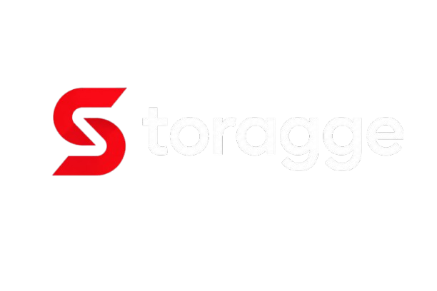

<p align="center">
  
</p>
<p align="center">
A modern AI Tools Directory built to discover, organize, and access the best AI tools from one place.
</p>

---

## ✨ Features

- 🔍 Fast AI Tool Search
- 📂 Category-wise AI Tools
- ⚡ Quick URLs
- 👤 User Authentication
- 🛡️ Secure Admin Panel
- ➕ Add/Delete AI Tools
- 📁 Add/Delete Categories
- 📊 Dashboard Analytics
- 👥 User Management
- 📈 Tool Usage Tracking
- 🌙 Dark Modern UI
- 📱 Fully Responsive Design

## 🛠️ Tech Stack

- React
- TypeScript
- Vite
- Tailwind CSS
- Supabase
- Lucide React

## 📦 Installation

```bash
git clone <repository-url>

cd storagge

npm install

npm run dev
```

## 🔨 Build

```bash
npm run build
```

## 📂 Project Structure

```text
src/
├── components/
├── lib/
├── pages/
├── types/
├── hooks/
├── App.tsx
└── main.tsx
```

## 🌐 Live Demo

Deployed on Vercel.

## 📄 License

MIT License

---

# 👨‍💻 Developer & FOUNDER

### Haarsh Aacharya

